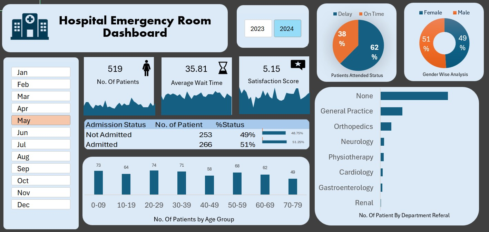

# Excel Interactive Dashboard Project 📊

## Project Overview
This project is an **interactive Excel dashboard** created as a portfolio project to demonstrate data analysis and visualization skills.  
It focuses on transforming raw data into meaningful insights using Excel features.

## Dataset
The project uses a structured dataset related to **hospital emergency room records**, which includes multiple variables useful for analysis and reporting.

## Key Features
- Interactive dashboard design
- Data cleaning and preparation
- Use of Excel formulas and functions
- Visual representation using charts and tables
- User-friendly layout for easy interpretation

## Skills Demonstrated
- Microsoft Excel
- Data Cleaning
- Data Analysis
- Dashboard Design
- Data Visualization

## Project Structure
- Dataset file(s)
- Excel dashboard file
- Supporting files (if any)

## Learning Outcomes
- Improved understanding of real-world datasets
- Hands-on experience with Excel dashboards
- Practical application of data analysis concepts

## Author
**Anushka Kamble**  
Aspiring Data Analyst

## Dashboard Preview

